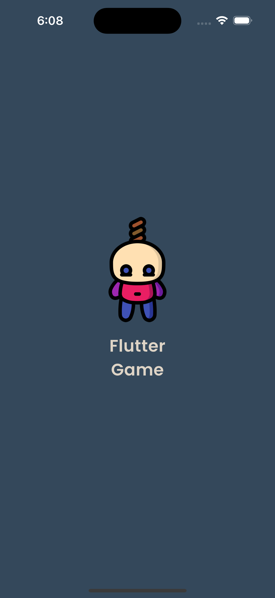
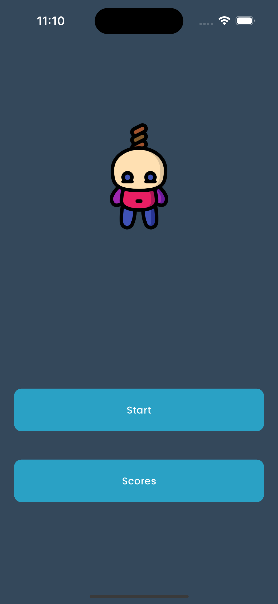
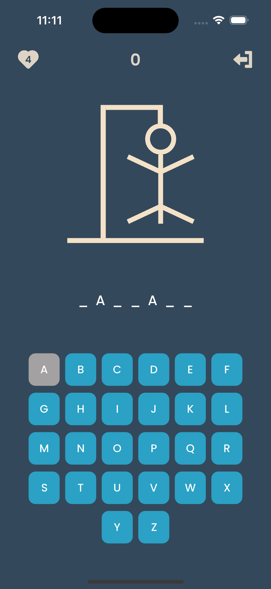
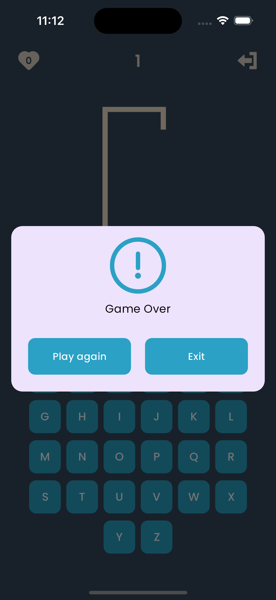

# Flutter Game

Welcome to Flutter Game! This is a simple guessing game built using Flutter, with state management handled by the BLoC pattern and local data storage managed by Hive.

## Features

- Play the game.
- View the score card to keep track of your performance.
- State management implemented using the BLoC pattern for efficient and scalable code.
- Local data storage handled by Hive for seamless data persistence.

## Game Rules

1. **Objective**: Guess the secret word before you run out of attempts.
2. **Gameplay**:
    - The game starts with a hidden word, displayed as a series of underscores representing each letter.
    - Player will having 5 lives.
    - You can guess letters one at a time.
    - If the letter is in the word, it will be revealed in its correct position(s).
    - You win if you guess all the letters in the word before the hangman is fully drawn.
    - You lose if once the hangman is fully drawn before completing the word.
3. **Scoring**:
    - Each successful guess earns points.
    - Your score is displayed on the score card.

## Getting Started

Follow these instructions to get a copy of the project up and running on your local machine for development and testing purposes.

### Prerequisites

- Flutter SDK installed on your machine. If not, follow the official [Flutter installation guide](https://flutter.dev/docs/get-started/install).
- Git installed on your machine. If not, you can download it from the [official Git website](https://git-scm.com/downloads).

### Installation

1. Clone the repository to your local machine:

```bash
git clone https://github.com/himanshu077/flutter-game.git
```


2. Install dependencies:
```bash
flutter pub get
```

3. Run the app:
```bash
flutter run
```

## Acknowledgments
- Flutter
- Hive
- BLoC pattern

You can download the apk from the [link](https://drive.google.com/file/d/1_a4I3Jtn-18_XgET9ruG49xoxVa0Jldw/view?usp=sharing)


## Screen shots
    